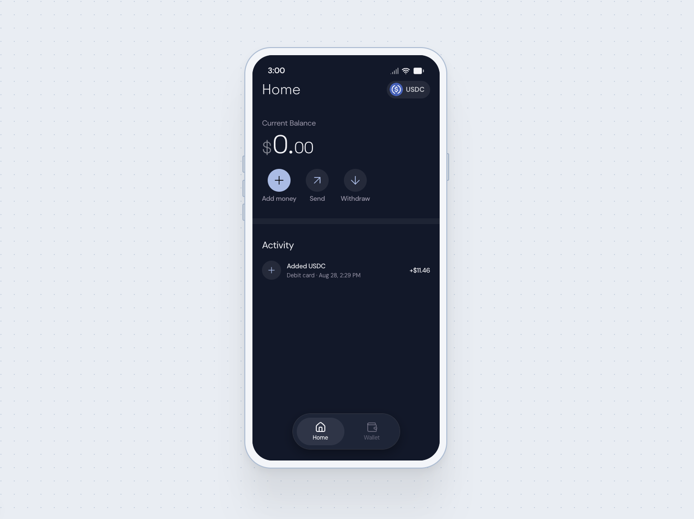

# USDC Onramp Demo

Buy USDC directly into a connected MetaMask wallet with
[Circle Onramp Kit](https://developers.circle.com/). This Next.js sample
demonstrates how to create a secure, single-use onramp session on the server and
open Circle's hosted onramp experience from the browser.

> [!WARNING]
> **Sandbox is the default, and leaving it that way is deliberate.**
> `ONRAMP_API_BASE_URL` and `NEXT_PUBLIC_ONRAMP_WIDGET_BASE_URL` are set to
> Circle's sandbox endpoints in `.env.example`. If either is unset, empty, or
> removed, the app falls back to Circle's production endpoints on mainnet and
> **every purchase moves real money and charges a real payment method.** Only
> unset these when you intentionally want to run against production/mainnet.



## Table of Contents

- [Prerequisites](#prerequisites)
- [Getting Started](#getting-started)
- [How It Works](#how-it-works)
- [Environment Variables](#environment-variables)
- [Supported Assets](#supported-assets)
- [Available Scripts](#available-scripts)


## Prerequisites

- **Node.js 20.9 or later** — See the
[Node.js download page](https://nodejs.org/en/download). Node 22 is the safest
choice for the canary builds.
- **MetaMask** — Install the
[MetaMask browser extension](https://metamask.io/download/)
- **Circle Developer account and kit key** — Create and manage kit keys in the
[Circle Developer Console](https://console.circle.com/api-keys). A kit key
belongs to one environment: a sandbox key is rejected by production and a
production key is rejected by sandbox, so you need the key that matches the
environment you intend to run.


## Getting Started

1. Clone the repository and install dependencies:
  ```bash
   git clone https://github.com/circlefin/onramp-demo.git
   cd onramp-demo
   npm install
  ```
2. Create your local environment file:
  ```bash
   cp .env.example .env.local
  ```
3. Add your Circle **sandbox** kit key to `.env.local`:
  ```bash
   ONRAMP_KIT_KEY=KIT_KEY:<keyId>:<keySecret>
  ```
   Keep this key server-side. Do not expose it through a
   `NEXT_PUBLIC_` environment variable or commit `.env.local` to source
   control.
   Leave the sandbox endpoints copied from `.env.example` in place. Removing
   either line points the app at mainnet, where purchases involve real funds.
4. Start the development server:
  ```bash
   npm run dev
  ```
5. Open [http://localhost:3000](http://localhost:3000), open the **Wallet**
  tab to connect MetaMask, then select **Add money** on **Home**.
   Circle's hosted onramp experience opens in a sheet over the phone screen. If
   you opt into popup mode with `NEXT_PUBLIC_ONRAMP_POPUP=1`, your browser must
   allow popups for the application. On production the sheet is not available
   and the popup is used automatically, so allow popups there in any case.


## How It Works

1. The user connects a MetaMask account from the **Wallet** tab.
2. The browser requests a session from `POST /api/onramp/session`, providing the
  connected wallet as the destination address.
3. The server uses `@crcl-main/onramp-kit` and `ONRAMP_KIT_KEY` to create a
  single-use session.
4. Selecting **Add money** opens Circle's hosted onramp experience with that
  session, mounted in a sheet over the phone screen.
5. After the session is consumed, the app prepares a new session for the next
  purchase.

Setting `NEXT_PUBLIC_ONRAMP_POPUP` to `1` or `true` changes step 4: the hosted
experience opens in a popup window instead of the embedded sheet. It is left
commented out in `.env.example`, so embedding is what you get unless you ask for
the popup.

> [!IMPORTANT]
> The embedded sheet is supported on sandbox only. The production widget accepts
> being framed only by origins registered with Circle, so embedding it from a
> local or unregistered origin fails with a cross-origin error and an empty
> sheet. The app detects production and opens the popup instead, regardless of
> `NEXT_PUBLIC_ONRAMP_POPUP` — no configuration change is needed, but the
> browser has to allow popups for the site.

This separation keeps the kit key on the server. The browser receives only the
short-lived session required to open the hosted experience.

## Environment Variables


| Variable                             | Scope       | Purpose                                                                                                                                                |
| ------------------------------------ | ----------- | ------------------------------------------------------------------------------------------------------------------------------------------------------ |
| `ONRAMP_KIT_KEY`                     | Server-side | Authenticates server requests made through Circle Onramp Kit. Must match the environment the base URLs point at.                                       |
| `ONRAMP_API_BASE_URL`                | Server-side | Circle API endpoint. Set to `https://api-test.circle.com` for sandbox. Unset means production (`https://api.circle.com`).                              |
| `NEXT_PUBLIC_ONRAMP_WIDGET_BASE_URL` | Browser     | Hosted widget endpoint. Set to `https://onramp-sandbox.arc.io` for sandbox. Unset means production (`https://onramp.arc.io`).                          |
| `NEXT_PUBLIC_ONRAMP_POPUP`           | Browser     | Opt in to opening the hosted experience in a popup window. Unset (the default) embeds it in the phone UI on sandbox; production always uses the popup. |


Next.js inlines `NEXT_PUBLIC_*` variables at build time, so restart the
development server after changing `NEXT_PUBLIC_ONRAMP_WIDGET_BASE_URL` or
`NEXT_PUBLIC_ONRAMP_POPUP`.

> [!CAUTION]
> Deleting, commenting out, or blanking **both** `ONRAMP_API_BASE_URL` and
> `NEXT_PUBLIC_ONRAMP_WIDGET_BASE_URL` switches the whole integration to
> production/mainnet, where transactions settle with real money and cannot be
> reversed. Changing only one of them is refused at startup rather than run in a
> broken half-state. Change them only for a deployment you intend to run against
> production, and swap the kit key at the same time.


## Supported Assets

The hosted experience is scoped to USDC on the following MetaMask-compatible
networks:

- Arc
- Ethereum
- Base
- Arbitrum
- Polygon
- Linea
- Avalanche
- Unichain
- Celo
- HyperEVM
- Ronin

This list controls what the sample requests the widget to display. Circle's
asset catalog remains the source of truth for current asset and network
availability.

## Available Scripts

- `npm run dev` — Start the Next.js development server
- `npm run build` — Create a production build
- `npm run start` — Start the production server
- `npm run lint` — Run ESLint
- `npm run typecheck` — Check TypeScript types

## Legal disclaimer

Sample apps provided for demonstration and educational purposes only, intended for Arc testnet use only, and not production-ready. See [Arc.io](https://arc.io) for more.